# gr-examples
> A collection of instructive examples that introduce the various features in Grimoire.js

## 2d-graph

## 360-image
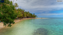

## animation
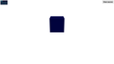

## clover

## debug-sphere

## earth

## geometry-camera
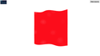

## geometry-example2
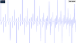

## geometry-example3

## geometry-points
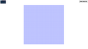

## geometry-video
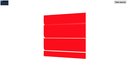

## geometry-video2

## geometry-video3

## geometry-wave
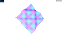

## geometry-wave2

## hand-skybox
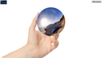

## hand-spinner
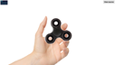

## jenga
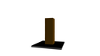

## light

## multipass-rendering
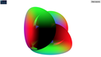

## normal-map
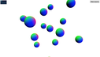

## particle
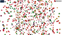

## physics

## points-cube
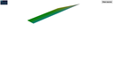

## points-sphere

## points-wave
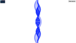

## raymarching
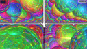

## rotate-cube

## rotate-eye
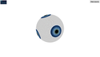

## rotate-sphere2

## sample

## shader-art

## shader-art2

## sort
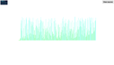

## sort-example

## sort-example2

## syncHTML

## texture

## texture-sphere

## vertex-sphere

## video-texture

## web-camera

