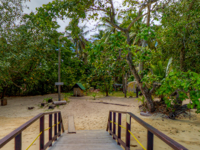
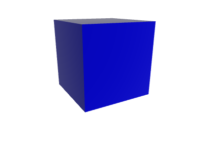
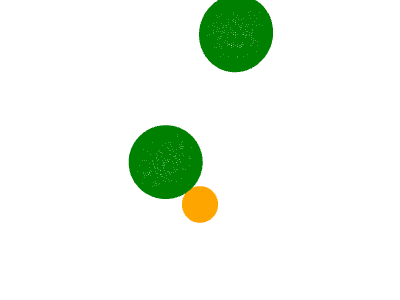
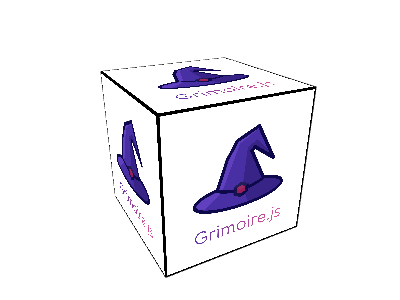
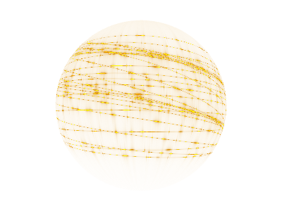
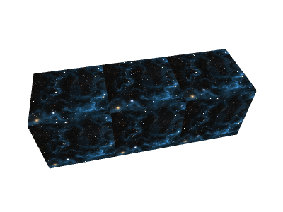

# gr-examples
> A collection of instructive examples that introduce the various features in Grimoire.js.

## 360-image

A 360 degree image is displayed.

## animation

## clover

## cube

## earth

## geometry-points

## normal-map

## particle

## physics

## raymarching

## rotate-cube

## sample

## shader-art

## shader-art2

## shine-a-torch

## sort

## syncHTML

## texture

## wave

## web-camera

